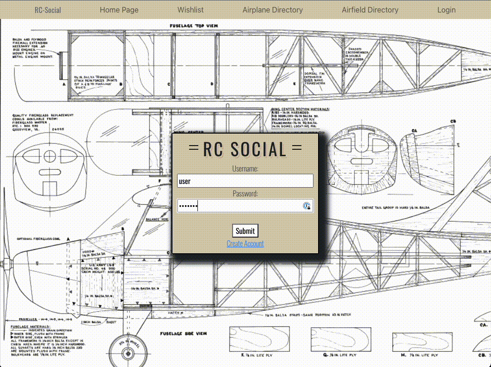
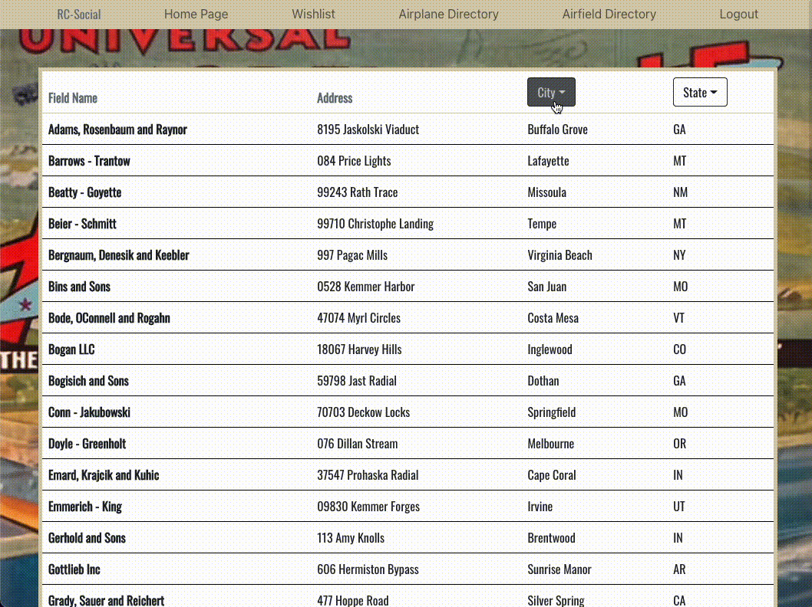

# RC Social

Live Site: https://rc-social.herokuapp.com/login

#### Technologies Used
React, Node.js, Express.js, Axios, PostgreSQL, Bootstrap, CSS Modules, bcrypt, JSON Web Token

#### Features

- Create Account
- User Login/Logout
- Post and comment creation
- Post and comment deletion
- Airplane model directory
- Ability to add airplane to individual wishlist
- Ability to delete airplane from wishlist
- Flight field directory
- Ability to filter fields by city/state

Login information is secure as passwords are hashed with bcrypt and JWT middleware provides a token for further authentication.

The airfield directory offers a filter so the user can find flight fields based on the city or state included in the dropdown input.

